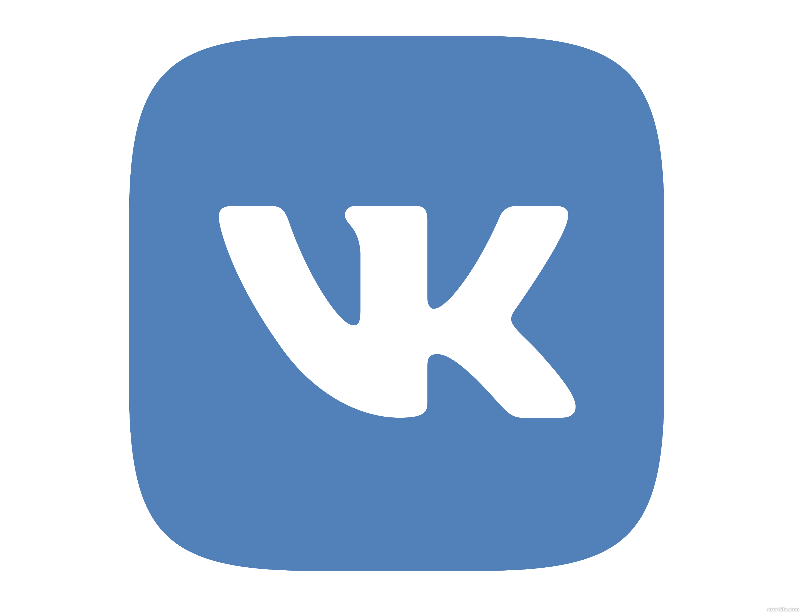

# VK

**Это проект на собеседование в VK**

Стек:

* Database: PostgreSql
* Language: Golang
* REST API
* net/http

Запросы :

* На все post, delete запросы нужен токен за правами админа
* На get любой валидный токен
* Токен ставится в заголовок Authorization

